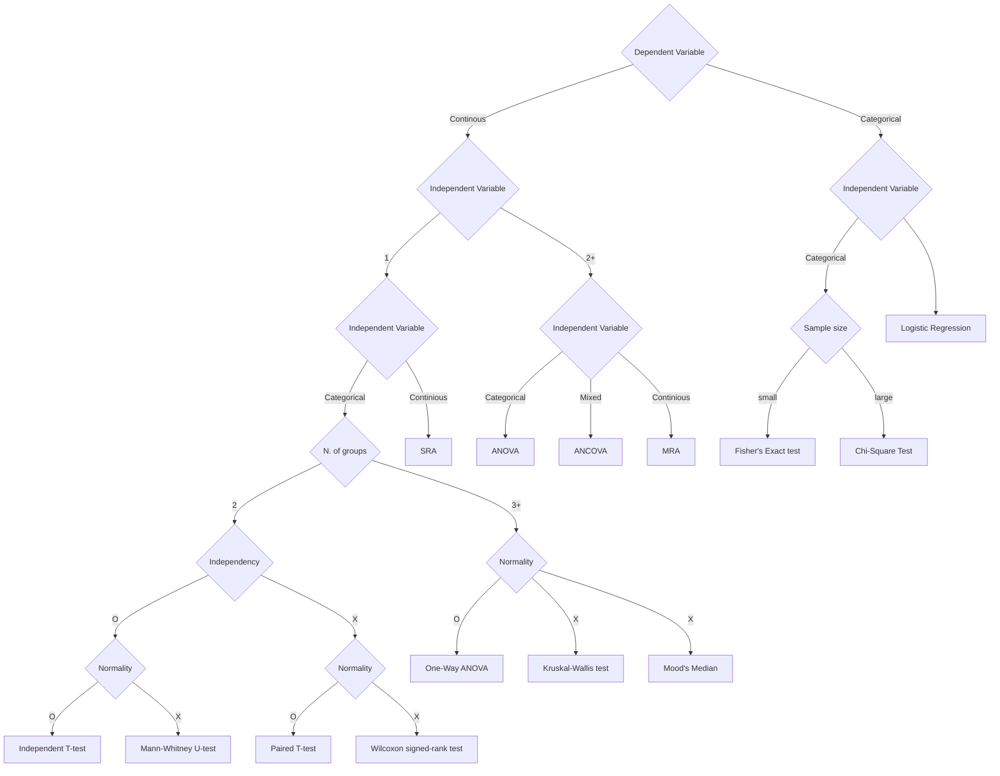

# Bio

#####  Transversion
  ↔ Transition
point mutation w/ purine(A/G, two ring) ↔ pyrimidine(T/C, one ring)

##### Transition

##### Exaptation
= Co-option

##### G-band
= Giemsa banding

##### Blacklist       
- ENCODE Blacklist project. 
- Cut&Run
- 

##### ECM
Extracellular Matrix
주로 collagen, gibronectin, laminin, gelatin등의 구성
##### EMT
Epithelial-mesenchymal Transtition
Adherent → Suspension
##### MET
Mesenchymal-epithelial Transtition
Suspension → Adherent
##### MoA
Mechanism of Action
주로 어떤 약물에 대해 그 작용 기전 전체를 말함
##### Cohort

##### FFPE
formalin-fixed paraffin-embed

##### TAD
Topologically Associated Domain
Chromosome 상에서 일부 chromatin들이 3d fold를 통해 서로 interaction하는 영역

하위는 Loop
상위는 Compartment(Chromosome의 일부 영역) / Territories(여러 Chromosome이 존재 가능한 nuc. 의 일부 영역)

##### CTCF
CCCTC Binding Factor / Transcriptional repressor
Cohesin loading 후 Chromatin loop 형성

##### MOI
Multiplicity of Infection
Cell당 감염되는 박테리아의 배수

##### CDS
Coding Sequence
ORF중 splicing되어 실제 단백질로 번역되는 부분(exons)

##### UTR
Untranslated Region
3', 5'에 ORF 밖, 번역되지 않는 부분

##### ORF
ORF(Open Reading Frame) : Start codon - Stop codon까지의 모든 부분(Intron + Exon)

##### uORF
upstream open reading frame

##### Isoform
Same locus / Transcription - splicing 후의 mRNA strands

EX) Most eukaryotic genes encode multiple mRNA isoforms

##### G4 Structure
[Hänsel-Hertsch, R., Di Antonio, M., & Balasubramanian, S. (2017). DNA G-quadruplexes in the human genome: detection, functions and therapeutic potential. _Nature reviews Molecular cell biology_, _18_(5), 279-284.](https://www.nature.com/articles/nrm.2017.3)

##### AAV
Adeno-associated Virus
Used for viral vector delivery

##### SBS
Single Base Subtitution

##### SPG
Spatially Predictive Genes

##### BER
Base Excision Repair.

##### TC-NER
Transcription-Coupled Nucleotide Excision Repair
RNA pol II가 DNA damage를 감지 후 멈출 때 발생하는 복구 기작

##### MMR
Mismatch Repair

##### NHEJ
Non-Homologous End Joining

##### HR
Homologous Recombination
보통 DSB 수리
Compare with sister chromatid, forms D-loop(Holiday junction) while repair process.
https://www.nature.com/articles/cr20081

##### SV
Structual Variation
교과서에서 봤던 역좌, 전위 등 chromosome 단위 변형들.
##### IVT
In Vitro Transcript
In vitro로 만든 RNA strand\
##### Klenow Fragment
=Large fragment of E.coli DNA polymerase I
3’→5’ Exonuclease
보통 Blunt end 만들 때 사용
##### TAESP
Totally asymmetric simple exclusion process
a kind of translation model
##### SNP
Single Nucleotide Polymorpism
gene 상에서 하나의 염기 변이
##### Transformation
Non-viral DNA → Bacteria cell
##### Transfection
Non-viral DNA/RNA → Eukaryotic Cell
##### Transdution
Viral DNA/RNA → Bacterial / Eukaryotic Cell
##### Competent Cell
Transfection / Transformation / Transdution 이 잘 되도록 만든 Cell.

##### Metastasis
전이

##### Spillover
형광 스펙트럼에서 여러 dye간 파장대가 겹쳐서 발생하는 인식 문제.
이후 Compensation control을 따로 측정해서 확인해 줘야 함

##### HLA
Human Leukocyte Antigen
조직 적합성에 관련된 Antigen으로, 사람에서 6종류 발현중.
HLA typing으로 조직간 면역 반응을 추론 가능

##### TPRT
Target site primed reverse transcription
non-LTR Transposon이 encoding하는 enodnuclease에 의해 발생하는 RT+Priming mechanism

곤충에서 R1, R2는 28S rDNA locus를 타겟으로,
R1의 경우 APE(DNA Repair endonuclease)와 유사한 enodnuclease를
R2의 경우 type IIS restriction endonuclease와 유사한 endonuclease를 코딩함

##### TSD
Target Site Duplication
TPRT같이 insertion될 때, 양쪽 strand가 완전 같은 위치에서 잘라지지 않음(blunt하지 않음)
그래서 insertion 이후 repair 과정에서 양쪽에 같은 sequence 가 반복되는 패턴이 나옴

##### H&E staining
H : Hematoxylin + E : Eoisin Staining
흔히 보는 분홍색-보라색 조직 염색 기법.
의학/조직학에서 많이 쓰고,  각각 핵이랑 세포질 염색용

##### IHC staining
Immunohistochemistry staining
특정 단백질만 잡아서 staining

##### Bromophenol Blue
Protein staining / Gel electrophoresis 시 염색할때도 씀.

##### Coomassie Brilliant Blue
WB 등에서 protein staining

##### Silver staining
WB 등에서 protein staining 시 사용

##### DAPI 
Aka, `4', 6-diamidino-2-phenylindole`
358nm() - 48?nm() 파랑색 dye, DNA 주로 staining함. (RNA 약하게?)
핵 볼때 씀

##### Warburg effect
바르부르크 효과
Tumorgenesis 이후에, glucose metabolism이 glycolysis(>pyruvate, TCA, oxidative phosporelation)되는게 아니라 anarobic metablosim(>lactate)

##### q-arm
<> p-arm
chromosome 에서 centromiere 아래쪽 arm.

##### LNP
Lipid NanoParticle

Phospolipid / polyethylene glycol / cholesterol + (mRNA)

##### CRE
cis-regulatory elements

non-coding DNA 영역 중, 주면 유전체의 발현을 조절하는 요소

##### FRiP
Fraction of Reads in Peaks

### Clinic

##### SSF
Site-Specific Factor

##### IDC-10
International Statistical Classification of Diseases and Related Health problems
Topography(원발부위) 기입/coding 시 사용하는 방법. 
다만 그 행태(Behavior)와 진단(Morphology) 따라 코드 세분화
`C34.9 이나 D38.1` 같은 형태
##### ICD-O
International Classifications of Diseases of Oncology
Morphology 기입/coding 시 사용하는 방법. 
`C42.3, 2563/3` 같은 형태
Morphology(진단명) 4자리 + 그 형태 코드 붙어있음.

##### AJCC Staging
TNM Staging. T(Primary Tumor), N(Regional Lymph nodes), M(Distant Metastsis)의 암 분포 양상을 표현.
숫자가 높을 수록 위험함
T0 : Primary Tumor의 근거 없음 >> T1s : Carcinoma >> T1, 2 3 4 : Increasing Tumor
N0 : Regional Lymph node의 metastasis 없음 >> N1 2 3 : Regional lymph involve
M0 : No distant metastasis >> M1 : Present distant metastasis

##### SEER Staging
암과 원발부위 간 거리 기반 분류.(General staging Summary staging, California staging)
0 : In situ(처음 생긴 부위만 존재)
1 : Local(장기 경계 안쪽)
2+ : Extent

##### RiA
Radio-Immunoassay

##### iRMA
Immunoradiometric assay

https://nm.amc.seoul.kr/asan/depts/nm/K/bbs.do?pageIndex=7&menuId=920&contentId=112150&searchCondition=&searchKeyword=

### Motifs

##### TATA box

##### CpG site
C phosphate G - site
Cytosine can be methylated into 5-methylcytosine, 5-methylcytosine deaminated into thymine

transcription start site located near

If CpG shows high freq, called CpG island.
##### Kozak Consensus sequence
In eukaryotic mRNA, motif of protein translation init.
5’ - (gcc)gccRccAUGG - 3’

##### Shine-Dargano Sequence
=SD sequence
In prokaryotic mRNA, motif of protein translation init.
5’ - GAUCAUUA - 3’
##### 5’ TOP
5' Terminal oligopyrimidine tract
approx ~12aa seq(pyrimidine) @ 5' m7G cap
##### eQTL
 expression quantitive trait loci
 expression level에 영향을 주는 염기 변이가 있는 게놈 영역

##### PAM sequence
NGG - 3’
CRISPR-Cas9 System, tracrRNA detection site

##### DRACH motif
A/G/U - A/G - A - C - A/C/U motif(IUPAC 코드다)
mRNA에서 m6A 관련한 Motif.
## Pathways
https://reactome.org/PathwayBrowser/

### NF-κB

### MAP

### JAK

## Proteins

##### BSA
Bovine Serum Albumin
= Fraction V
값싸서 단백질 농도 잡거나, 다용도 사용…
Blocking buffer에 사용. Skim milk도 blocking
##### HRP
Horse Radish Peroxidase. 
Can oxidize luminol with H2O2, cause chemiluminescent(ABC reaction)
secondary ab용 conjugate enzyme ex)Avidin-HRP(ABC) system
* Buffer 내 [[Terms#Sodium Azaide|NaN3]] 가 Inhibitor로 작용할 수 있음

##### AP
Alkaline phosphatase
secondary ab용 conjugate enzyme
* Buffer 내 Phosphate(ex:PBS)가 Inhibitor로 작용할 수 있음

##### AFP
alpha-fetoprotein
간암 지표!

##### Trypsin
Serine protease. Argine/Lysine의 C단을 절단함
Trypton이란 이름으로 시약화됨.
주로 dish에 붙은 cell(Adherent cells)을 떨어트릴 때 사용
부착하는 AJ(Adherent junction)/TJ(Tight junction) protein들이 주로 cofactor Ca2+를 써서 EDTA와 함께 떼어냄
Enzymatic dissociation 방법이라 stress를 주긴 하지만, 잘 안 떨어지면 Dispase, Collagenase 등을 같이 쓰는 경우도 있음.
https://www.thermofisher.com/kr/ko/home/references/gibco-cell-culture-basics/maintaining-cultured-cells.html

##### Miyazawa-Jernigan potential matrix

## Chemical

##### EGTA
Calcium chelator.
Ca를 사용하는 단백질을 저해(No influx-apoptosis)
##### Tris
Tris(hydroxymethyl)aminomethane
NH₂C(CH₂OH)₃
매우 강한 염기성 = Anion 공급
##### EDTA
+2 Ion chelator. - arm 4개
주로 Mg2+를 사용하는 단백질(DNAse, RNAse) 저해
 그래서인지 우리 랩에선 metal ion 잡아서 oxidative damage를 막을 때도 쓰더라
SDS-PAGE에서 DNA 안정화하는 Mg2+, Ca2+등을 빼내 DNA (-) charge 와 분자량 correl
식물 세포의 경우 세포벽의 Ca2+를 빼내서 세포벽 파괴에도 사용
Dissociation 시 trypsin과 함께  adherent protein이 쓰는 Ca2+를 훔쳐가서 결합을 약하게 해줌.
##### EGTA
Aminopolycarboxylic acid = egtazic acid
Mg 친화력이 낮아서 Ca를 더 잘 당김
##### NP-40
Mild Non-ionic Detergent.
세포막/핵막 파괴시 사용. TritonX-100, Tween20이 같은 역할

##### Digitonin
MILD detergent
ATAC-seq 등에서 약하게 구멍 뚫을 때 사용. Tween20/NP40도 씀
##### TritonX
Mild Non-ionic Detergent
##### Tween20
Mild Non-ionic Detergent

##### DFAM
Deforoxamine mesylate
kind of antioxidant

##### BHT
Butylated hydroxytoluene
kind of antioxidant

##### ARP
=Aldehyde Reactive Probe ~~Adress resolution protocol~~
Aldehyde랑 keteon과 반응해 biotinylation 
##### NaF
Phosphatase/ Serin protease Inhibitor
##### Sodium Azaide
=NaN3
방부제/항진균제
버퍼 오래 보관하고 싶을 때 쓰지만… 사람마다 의견이 갈림.
Lead나 Copper (Plumbing)에 반응해 금속 질산염으로 폭발성을 띌 수 있으니 주의.
##### Chaotropic agent
Hydrogen bonding 제거용 물질(주로 1가 염)
ex) Guanidin sodium salt, urea, sodium iodide
Protein unfolding/denature, Cell lysis, DNA-silca ion exchange bridge 등

##### DEAE
Diethylaminoethyl celluose
pl 위의 pH에서는 양전하를 통해 음전하 단백질 등을 정제시 사용(sepharose)
이후 pH나 염도 변화로 정제

##### Sepharose
Agar로 만든 bead
IP 등에서 Affinity bead, chromatography 등에 사용

##### Streptavidin
=~Avidin
원래 Avidin은 당단백질로, 4 subunit <> 4 biotin attract, 당이 단백질의 10%정도.
근데 Streptavidin은 당 없이, 4 subunit, less non-specefic interaction, 낮은 해리도
문제는 RYD(Arg-Tyr-Asp) 서열이 cell adhesion motif인 RGD와 유사해서 cell surface에 비특이적으로 붙을 수 있는데, 이는 재조합된 Neutravidin/Extravidin 사용하면 됨.

##### ABC
Avidin-Biotin complex

##### Protease/Phosphatase inhibitor cocktail
Leupeptin (10mg/ml)
Aprotinin (10mg/ml)
PMSF (100mM)
Okadaic acid (20nM)

##### Heparin
RNAse inhibitor.
혈액 응고 방지 물질로도 알려짐
##### Triton
Cell lysis, Protein precipitation
##### DMSO
Dimethyl Sulfoxide
Cell stock이나 culture에서는 얼린 cell이 터지지 않도록 방지
Freezing media에 보통 10%로 들어감
실온에서는 cell membrane을 파괴하기 때문에 주의

사용 시 얼릴 때에는 cryopreservation freezing container에 넣고 LN에서 두면 분당 1도씩 천천히
다시 해동 시에는 37도 bath에서 빠르게 녹이고 DMSO를 .5% 이하로 희석해 줘야 함.
##### FBS
Fetal Bovine Serum
Cell culture시 사용. 다만 complement나 inhibitor등이 존재해 면역 세포 배양 시 AB와 결합-cytotoxicty를 보일 수 있으므로 ES cell, insect cell line등에서는  heat inactivation해 줘야 함.
[[Terms#Trypsin |Trypsin]] inhibitor(alpha-2-macroglobulin)이 첨가되어 있어서 이후 Trypsin처리 시에는 DBPS등으로 wash해줘야 함. 반대로 재배양시 FBS 처리 해주면 trypsin이 다시 정지.

##### alpha-2-macroglobulin
Trypsin inhibitor.

##### TRIzol
=TRI Reagent
DNA/RNA/Protein Isolation 과정에서 사용되는 시약…
기존 LiCl Precipitation(Phenol-Ethanol+ LiCl(Lithium Chloride) + Ethanol) 기반 기법에서 Trizol의 Guanidine isothiocyanate가 RNAse 억제.
다만 상대적으로 DNA contamination 가능성이 있음
방법은 비슷! 
싫으면 column 써야지 뭐…
##### ME
=beta-mercaptoethanol, $\beta$ ME
Disulfide bond 제거, -OH radical 제거
주로 항산화제 역할로 DNA 등 보관 시 사용하거나
RNAse의 Disulfide bond 부숴 RNA isolation 시 파괴되지 않도록 사용

##### Chloroform
~~It’s chlorolform~~
RNA prep에서는 Pheonl 제거

##### Isopropanol
RNA prep에서는 RNA precipitation(Illusion)

##### DFOM
= DFO, DFOA, Desferroxamine
Reduce In-vivo oxidation by chelating 2/3 ions (like EDTA, inhibiting in-vitro fenton)

##### DTT
Dithiothreitol
Redox, Reduce disulfide bonds, Thiolated DNA reducer

##### Cycloheximide
Translation / Ribosome blocker

##### DPEC
Diethyl pyrocarbonate
RNase inhibitor

##### GST
GST elution & Reduced Glutathione elution buffer
GST-tag된 단백질은 해당 buffer에서 elution, preserve
##### Isopropanol
세포 단백질과 DNA 분리, DNA 침전

##### PCI
Phenol:Chloroform:Isoamyl alcohol (25:24:1)

Phenol : dissolve protein
Chloroform : dissolve hydrophobics/Phenols
Isoamyl alcohol : Protect phenol from oxygen, dissolve hydrophillics

Centrifuge하면 아래에 Chroloform-phenol 층, 중간에 단백질, 위에 Isoamyl alcohol 

##### DPBS
Dulbecco’s Phosphate buffered saline
PBS처럼 buffer이고, 여기에 Mg2+ 나 Ca2+(MgCl2, CaCl2) 같은 세포 생장(막 평형이나 신호, 효소 등) 에 필요한 이온이 포함됨
추가로 Glucose가 들어가는 경우도 있음.
### Dyes / Indicators

https://www.bio-rad-antibodies.com/spectraviewer.html
##### FITC
Fluorescein isothiocyanate
##### CFSE
세포막을 투과해서 단백질에 결합하는 dye. (Parish, 1999)
보통 cell proliferation마다 이론상 $1/2^n$꼴로 감소할 것이기 때문에 분열 시기로 구분 가능.

##### PE
Phycoerythrin

##### APC
Allophycocyanin

##### Sybr dye

##### Annexin V
Phospholipid 중 Phosphatidylserine(PS)와 결합하는 dye
Apoptosis 시 PS가 세포 바깥으로 재배치되므로, 이를 감지할 수 있음
Ca2+ 포함된 buffer 사용해야함

##### Tandem Dye
두 형광물질이 붙어 있는 FRET과 비슷한 작용하는 Dye.
Batch/Vial마다 결합비나 농도 차이가 발생할 수 있어서 주의.
ex) PE-Cy7, PE-eFluor 610, PerCP-Cy5.5, APC-Cy7

##### AF series
Alexa Fluor Dye. AF N 꼴이며 Exciation wavelength가 기록되어 있음
https://www.bdbiosciences.com/en-us/applications/research-applications/multicolor-flow-cytometry/product-selection-tools/spectrum-viewer

##### eFluor series
eFluor N 꼴이며 Emission wavelengh가 적혀 있음.
https://www.thermofisher.com/us/en/home/life-science/cell-analysis/labeling-chemistry/fluorescence-spectraviewer.html#!/

##### GECIs
Genetically encoded calcium indicators.
Calmodulin이 대표적

### Antibiotics
P/S : Penicillin/Streptomycin. P/S double tolerent bacteria도 존재

##### Penicillin
근-본 antibiotics. Bacteria 대상
##### Sterptomycin
역시 세균용 항생제.

##### Gentamicin
세균용 항생제

##### Amphotericin B
Antimycotic(진균용 항생제)

##### Ampicillin

##### Carbenicillin

##### Chloramphenicol

##### Kanamycin

##### Tetracycline

##### Neomycin
Bind prokaryote ribosome, block polypeptide 

##### G418
~Gentamycin B1
Block Polypeptide 

### Buffers

##### TAE
TAE buffer
Tris + Acetate + [[Terms#EDTA |EDTA]]
Tris가 양이온 공급, Acetate가 pH 조절하는 buffer

주로 전기영동에서 사용
##### TBE 
TBE buffer
Tris + Borate + [[Terms#EDTA |EDTA]]
Boric Acid로 조절한 경우. TAE보다 비싸지만 높은 gel electorphoresis resolution, capacity. (주로 작은 크기 DNA 확인 시)
다만 그래서 이동이 느림

주로 전기영동에서 사용

##### SB
Sodium Borate buffer
TAE, TBE보다 빠르지만 효율 안좋아서(+열 더 난다고 함) 잘 안씀..

##### Sodium Acetate buffer

##### Washing buffer
주로 EtOH, DNA를 제외한 salt 등을 wash
##### Elution buffer
Silica resin column으로부터 DNA를 녹여서 떼어냄
##### Phosphate buffer

##### PBS
Phosphate Buffered Saline
Buffer + Osmolarity 다 챙긴 거이 기본 버퍼.
Cell dislocation, immunostaining, cytometry 등등…
###### DPBS
PBS + potassium chloride(KCL). (+ca, mg, glu, pyruvate)
비슷한데, 주로 tissue에 안 좋은 영향을 줄거 같을 때(Dissection, perfusion, IP, cell therapy) 조금 더 선호
KCL이 세포 독성을 낮춰준다고 함.(Na/K ATPASE pump?)
##### PBE
Phosphate Buffered [[Terms#EDTA |EDTA]]
##### Tris-HCL
acidic Buffer. 
##### TBS buffer
Tris-buffered saline buffer

##### PBST buffer

##### TBST buffer
##### RIPA buffer
containing ionic detergent, ion chelator + (protease inhibitor) with Tris-HCL buffer
detergent로 cell/nuclear membrane을 깨고 EDTA+inhibitor로 protein 보호
주로 Western blot에서 단백질 추출 시 사용
##### Laemmli buffer

##### HEPES buffer
HEPES(N-2-hydroxyethylpiperazine-N'-2-ethanesulfonic acid)
- Useful at long-time incubation?
- Show cytotoxicity (reaction with light, create h2o2)
##### EBSS
Earle’s Balanced Salt Solution
둘 다 osmolarity + PH 챙기는 culture 용 버퍼는 맞음.(PBS + alpha 느낌)
주로 glucose, pyruvate, Ca, Mg 추가됨.

다만 Co2 평형을 sodium bicarbonate(HCO3-)로 유지해서 Co2 incubator가 필요.
##### HBSS
Hank’s Balanced Salt Solution
둘 다 osmolarity + PH 챙기는 culture 용 버퍼는 맞음.(PBS + alpha 느낌)
주로 glucose, pyruvate, Ca, Mg 추가됨.

EBSS보다 sodium bicarbonate가 덜 들어가서 Co2가 적은 일반 대기에서 키울 수 있음.
##### Ealre’s Salt

##### Hank’s Salt

### Media
aka, Broths
##### LB media
Lysogeny Broth / Luria-Bertani Broth
10g Tryptone
.5g Yeast extract
10g NaCl
in liter
Lennox media의 경우 5g NaCl
Miller media는 위 조성과 같음
##### TB media
Terrific Broth
11.8g Tryptone 
23.6g Yeast extract
9.4g Dipotassium hydrogen phosphate
2.2g Potassium dihydrogen phosphate
4ml .4% Glycerol
in liter
neutrient-rich, glycerol을 줘서 glucose 계열 대사가 억제됨(lacI)
##### SOC media
Super Optimal broth with Catabolite repression
2g Tryptone
.5g Yeast extract
2ml 5M NaCl
250ul 1M KCl
1ml 1M MgCl2
1ml 1M MgSO4
2ml 1M Glucose
Transformation 이후 cell recovery에 사용
Glucose를 넣어서 기타 catabolic path 억제
##### BHI media
Brain Heart Infusion
Infusion from brain heart 6g
Peptic digest of tissue 6g
Pancreatic digest of gelatin 14.5g
Sodium chloride 5g
Dextrose(D-Glucose only) 3g
Disodium Phosphate 2.5g
(+ Hemin 5mg)
(+ Vitamin K .1mg)
per liter

까다로운 미생물(Fastidious microorganism)에 쓰임.
anarobic… 등
##### CBA media
Columbia Blood Agar
Pancreatic digest of casein 12g
Peptic digest of tissue 5g
Yeast extract 3g
Beef extract 3g
Corn starch 1g
Sodium chrolide 5g
Agar 13.5g
+Sheep blood(Defibrinated) 5% (After agar media, autoclave, cooldown)
위와 비슷한 역할

##### BME
Basal Media Eagle
옛날 1950에 Hela cell 키울때 쓴 배지.
아미노산, 비타민 조성 관련해서 기반.
요새는 MEM이나 DMDM을 쓴다…

##### EMEM
Eagle’s Minimal Essential Medium
= MEM
BME보다 더 많은 아미노산 + EBSS buffer

EBSS base
2mM L-glutamine
1mM sodium pyruvate
1500mg/L sidoum bicarbonate

##### DMEM
Dulbecco’s Modified Eagle’s Medium
MEM + 아미노산, 비타민, 탄수화물 등 추가
Sodium bicarbonite buffer 씀 == 5-10% CO2 농도 필요

EBSS base
4mM L-glutamine
4500mg/L glucose
1mM sodium pyruvate
1500mg/L sodium bicarbonate

## Experiments

### Euiqipment

##### E-Tube
eppendorf tube
##### Cryo tube
Cryopreservation용 Tube.
[[Terms#DMSO]] 참조!

##### Amber tube
For Photosensitive reagents

##### Collection tube

##### Concical tube
##### Column

##### Cuvette
큐벳. 보통 분광도계(Spectrometer)로 읽을 때 사용
##### AFA Vessels
보통 crimp-capped
##### Nanodrop
분광도계예요
##### TapeStation
Electorphoresis보다 좋다!
##### Capillary Electrophoresis
전기영동을 두 buffer를 잇는 얇은 capillary를 통해 진행
고압을 시간에 따라 주면서, 이동하는 물질의 형광도를 시간에 따라 측정 가능

### Short-term
##### OD
Optical density
##### RFU
Relative Flourence Unit
##### Flaming

##### Resuspend
Centrifuge 등으로 앉힌(pellet 등으로) cell을 다시 Media/Medium으로 섞어 주는 일
##### Supernatant
<> Precipitate / Pellet
상층액. 
무조건 버리는 것도 아니고, RNA prep 중에는 사이 막에 신경 써야 할 때도 있음.
##### Invert
=Flip
##### Vortex

##### Thawing
해동
37도 물에서 빠르게 녹이는게 중요
##### Aspirate
Suction / 혹은 plate를 털어서 media 제거하는 과정
##### Precipitation
침전
##### Titration
적정
##### Sucrose gradient
Sucrose cushion.
Sucrose 농도를 다르게 만든 뒤 ultracentrifuge, gradient는 서서히 묽어지는 방향(위)
cushion은 가장 아래 특정 농도의 sucrose 용액만을 깔고 centrifuge

##### UV ligation

##### Gel Electrophoresis

Agarose 기준

| Gel Concentration(%) | DNA size(Kb) |
| -------------------- | ------------ |
| .5                   | 1-30         |
| .75                  | .8-12        |
| 1                    | .5-10        |
| 1.5                  | .2-3         |
| 2                    | .01-.5       |

Polyacrylamide gel의 경우 → PAGE

##### Gel Purification
하기 전 long-wavelength UV로 보기.(DNA 파괴 방지)

##### Fenton reaction
H2O2 + Fe(II)
철을 촉매로 산화

##### Avidin-Biotin Interaction
=Streptavidin-biotin binding

##### FISH
Fluorescent in situ hybridization

##### Electroporation
= Electropermeabilization

##### Pipetting
https://www.ibric.org/bric/trend/bio-series.do?mode=series_view&newsArticleNo=8858877&articleNo=8882772&beforeMode=series_list&article.offset=0&articleLimit=10#!/list

###### Reverse Pipetting

###### Pre-wetting

### Big-term

##### Northern blot(RNA blot)

##### Western blot(Protein Immunoblot)
= WB, Immunoblot
###### Far-western blot
Complex 기반 Western blot.
 
##### Southern blot(DNA blot)

##### Eastern blot

###### Far-estern blot
##### PCR
taq polymerase, PFU 등으로…
Primer는 보통 100uM
T_m은 primer sequence 따라서, pol step 온도/시간은 enzyme에 따라서

###### Nested PCR
d

###### RACE-PCR
Rapid amplification of cDNA ends - PCR

##### Native-PAGE
Polyacrylamide gel electorphoresis

`%T = Acrylamide + Bisacrylamide concentration`
`%C = Bisacrylamide(cross-linker) concentration related to %T`
%T는 Gel의 밀도를, %C는 그 사이에 난 구멍의 크기를 결정
단백질 사용시 29:1(3.3%C), Peptide라면 19:1(5%C)
두 재료 중합으로 젤을 만들기 때문에 APS(Ammonium persulfate), TEMED를 사용해 줘야 함. 

| Gel Concentration(%T) | Protein size(kDa) |
| --------------------- | ----------------- |
| 20                    | 4-40              |
| 15                    | 12-45             |
| 12.5                  | 10-70             |
| 10                    | 15-100            |
| 8                     | 25-100            |

sample buffer에는 reducing agent(2-mercaptoethanol 5-20mM, DTT .5-1mM) 사용
https://www.ibric.org/bric/trend/bio-series.do?mode=series_view&newsArticleNo=8858225&articleNo=8882788&beforeMode=series_list&article.offset=0&articleLimit=10#!/list
##### SDS-PAGE
Sodium Dodecyl Sulfate - PolyAcrylamide Gel Electrophoresis

##### BLI
BioLayer Interferometry
- 얇은 세포막에 대해 적외선으로 구조/상호작용 추정
##### FISH

##### Plaque assay
Virus Titor(Titration)에 사용되는 방법 중 하나.

##### Blue-White screening
LacZ - Xgal 기반의 벡터 삽입 스크리닝

##### Transfer
보통 Wetsern blot에서 gel→membrane으로 단백질 전송시 사용하는 용어
Wet
Semi-dry

##### Flow Cytometry
Cell을 형광을 통해 분리하는 기법.

FSC(Forward Scatter), SSC(Side Scatter)로 세포의 크기와 granularity를 gating
이후 Viability dye(eFluor 506 등)로 죽은 cell을 걸러냄.

https://www.ibric.org/bric/trend/bio-series.do?mode=series_view&newsArticleNo=8854159&articleNo=8882772&article.offset=0&articleLimit=10&beforeMode=series_list#!/list

###### FSC
Fowrard scatter.
FSC-H, W, A로 각각 Height, Width, Area를 구분하며 A와 H값이 y=x 밖이라면 doublet

##### FACS
Fluorescence Activated Cell Sorting
Flow cytometry는 구분/필터링, FACS는 분류가 가능
세포가 있는 droplet에 전하를 부여해서 당길 수 있음
비싸서 모른다….

##### PAL-seq
PolyA tail 길이
##### TAIL-seq

##### DMS-seq
=Structure-seq

##### RPF-seq

##### Ribo-seq
Ribosome profiling
mRNA에 붙은 Ribosome 수 또한 expression에 연관.

##### IP
Immunoprecipitation

Anti Rat → protein A is preferred
Anti Mouse → protein G 

###### DRIP-seq
DNA-RNA hybrid인 R-loop을 타겟으로 하는 seq
##### ChIP-seq
Chromatin Immunoprecipitation followed by sequencing
DNA binding protein + 해당 위치 찾기
IP로 해당 단백질만 떨궈서 sequendcing

###### RIP-seq
RNA Immunoprecipitation ChIP sequencing
##### GRO-seq
Global Run-on sequencing
Nascent(newly synthized)  RNA-transcript seq
~ with BRIC-seq, Bru-seq, BruChase-seq

##### CLIP
Cross-linking and Immunoprecipitation
특정 단백질이 결합하는 seq 위치 찾기
crosslinking 후 IP로 찾는데, 문제는 해당 위치 서열() 만 볼 수 있었음

More @ this [paper](https://www.nature.com/articles/s43586-021-00018-1)
###### HITS-CLIP

###### PAR-CLIP

###### iCLIP

###### Clear-CLIP
원래 CLIP 시 위치만 알고, 어느 서열(혹은 RNA)인지는 알 수 없는데(비연결 부위는 degradation되기 때문)
아예 protein이 잡은 서열을 통째로 들고 오는 방법
##### irCLIP

###### eCLIP

##### ELISA
Enzume-Linked Immunosorbent Assay
단백질 발현량을 보기 위한 방법(like WB)

##### SPRI
Solid Phase Reversible Immobilization

##### Target-seq
특정 target 영역을 선택 후, 여러 번의 PCR 통해서 걸러냄

##### LiCl precipitation
RNA Purification & Precipitation
##### Gibson Assembly

##### IP-MS
Immunoprecipation-Mass spectography
##### Trizol Extraction

##### EMSA
Electrophoretic Mobility Shift Assay

##### DCFDA Assay
= H2DCFDA Assay
ROS detection

##### RNA-seq

##### Insert-seq

##### ATAC-seq
Find Open chromatin!
Open chromatin에 Tn5가 특정 adaptor를 transposition(adaptor insertion)함
그러면 seq할때 많이 insertion 한 영역이 그만큼 읽혀서, Tn5 transposition rate = read N = (Promotor accessibliility)

##### 3C methods
Intermolecular range, 어느 Chromatin끼리 interaction하고 있나?
보통 다른 chromatin끼리 Crosslink 후 digestion해서 붙은 fragment를 얻음
###### 3C
qPCR해서 frament를 ligation 후 찾기

###### 4C
Second-digestion 후 self-circulaization, inverse PCR로 seq

###### 5C
추가로 Oligo를 붙인 뒤에 PCR

###### ChIA-PET
Chromatin precipitation 후 linker ligation, proximity ligation 후 digestion하면 non-chimeric PET을 잡아서 seq

###### Hi-C
Restriction Enzyme(HindIII)로 자른 뒤 biotin marking, ligation 후 biotin pulldown

##### ChIC
Chromatin Immunoclevage
기존 [[Terms#ChIP-seq|ChIP]] 은 많은 세포와 높은 depth,를 필요로 함. 복잡하기도 하고. Immunoprecipitation이 어쩔 수 없음…
Antibody sensitivity가 늘면서 ChIC가 가능!

###### Cut-and-tag
Cleavage Under Targets & Tagmentation
주로 히스톤 PTM과 CTCF(CCCTC-binding factor) mapping

Ab + Secondary Ab 통해 Tn5로 adaptor ligation 이후 sequencing

Mg2+로 Tn5 activiation, tagging

	한번에 library 준비(adptor ligation)까지 하지만, 좀 더 sensitive(salt, handling 등)하고 복잡함. 하지만 적은 cell 수와 빠르게 처리 가능. 
###### Cut-and-run 
Cleavage Under Targets & Release Using Nuclease

Chromatin의 Protein-DNA complex 분리. 
pAG-MNase와 TF specific-AB로 TF가 붙은 위치만 잘라내서 sesquencing
굳이 TF 아니더라도, histone mod(PTM) 등도 가능!

CaCl2+로 MNase activation
##### DamID
to find LAD

##### CD Spectrography
CD : Circular Dimorphism
2nd structure 확인 간으
## Sequencing
### Sequencing Terms
##### Spike-in

- SIRVs
- ERCC

##### PTM
Post-Translation Modification

##### QTL
Quantitative trait loci
→ eQTL, sQTL, ie is…
##### eQTL
expression Quantitative trait loci
유전자 발현에 영향을 주는 서열 변이가 존재하는 게놈 영역
##### Sequins
 [Sequins](https://www.nature.com/articles/s41596-019-0175-1) : Sequencing spike-ins

##### T2T
=Telomere to Telomere

##### Dwell time
 Nanopore seq에서 pore 통과 시간이 길면 같은 value가 찍히는 시간 다만 pore에 있는 sensing region과 motor/helicase 위치는 12bp정도 차이 있음

##### UMI
Unique Molecular Identifier 
scRNAseq 등에서 여러 종류로 레이블된 marker로 손실 전 mRNA seq 양 보기 ~~우미-만멘미~~

##### Discordant read
<> Concordant(Proper) read
1. Read 1 and 2 have unexpedted mapping distance
	1. R1 ------→ Long unexp. dist ←-------R2
	2. ex) Genome deletion
2. Read 1 and 2 orientation are not matching
	1. R1------→ R2------→(FF)
	2. ex) Read on Duplicated genome boundary / reverse-duplicated
	3. R1←------- ------–>R2
	4. ex) Read on duplicated genome boundary 
3. 

##### Chimeric read
~ Split reads, Supplementary alignment
하나의 read가 서로 다른 두 genome 영역에 mapping
One of chimeric read will be represented as linear alignment

##### Representative alignment
<> Supplementary alignment
Linear alignment 중 대표성을 보이는 alignment
### Sequencing Methods

##### Illumina NGS
Sequencing by Synthesis(SBS) / Bridge PCR(ExAmp)

- 형광 dye label +  nucleotides
- 길이 길어지거나, 형광을 억제하는 경우가 존재

| 5'  | P5 Adaptor   | Index 1(I7) | Rd1 Primer site | (UMI) | Insert | (UMI) | Rd2 Primer site | Index 2(I5) | P7 Adaptor   | 3'  |
| --- | ------------ | ----------- | --------------- | ----- | ------ | ----- | --------------- | ----------- | ------------ | --- |
|     | Flow Cell 부착 | Lib Index   | Amp Primer      |       |        |       | Amp Primer      | Lib Index   | Flow Cell 부착 |     |
- P5/P7 따라 부착 후
- Index run에서 Index read
- Main PCR은 Primer site로 Insert Amp
- 

##### Pacbio ONSO
Sequencing by Binding(SBB) / p;re-PCR

##### DNA Nanoball
= DNBseq (BGI/MGI) / Rolling circle amp
Sequencing by Ligation

##### SMRT
SMRT(Single-molecule Real-time sequencing) : PacBio에서. 형광?

##### DRS
Direct RNA Sequencing
현재 쓰는 Nanopore Sequencing처럼 PCR-free / Direct RNA를 읽는 sequencing <->Long/Short read
Align 후 quantification(비교 위해서)에...

##### CCR

## Immunology
WIP 🛠️

HPS(Hematopoietic Stem Cell) → CLP(Common Lympohoid Progenitor) or CMP(Comon Myeloid Progenitor)
CLP → T/B, Lympoids
CMP → Dendrocyte, Granulocyte, Monocyte→Macrophage, Platelets, RBC…
 are called Effector.

Primary Lympoid Tissue : Bone marrow and Thymus
Secondary Lympoid Tissue : Lymph nodes (50% are @ Intentines, Splean)

Innate Immunology : Avoidance(Skin, mucosa barriers) / Resistance(AMP-Antimicrobial proteins like C3, defensins & Innate Immune cells like Macrophage, NK, granulocytes), Tolerance(Adaptive immunity by B and T cells)

Inflammatory Inducer : LPS(Lipopoly saccaride), urate crystals
→
Sensor cells : Macrophage(M∅), neutrophils, dendritic cells(DC) : Use PRR(Pattern Recognition Receptors) <> PAMPs(Pathogen Associated Molecular Pattern)
→
Inflammatory mediators : Cytok,ine, Cytotoxicity → Propagate and kill

Pathogen groups
- Virus, Bacteria, Fungi(Microorganisms) and Protozoa, Helminths(Parasites)
- Location : Extracellular(< AMP, Ab) / Intracellular(Cytoplasmic < NK, CTL / Vesicualr < M∅)
- Damage or Infection?
	- Direct damage : Exotoxin, Endoxotin, Direct
	- Indirect damage : Immune copmles, Anti-host Ab, Cell-mediated damage

### Innate Immunology

## Genes

### Base Modification

#### DNA Modification

- 5mC : 5-methylcytosine by DNMTs
- 5hmC : 5-hydroxymethylcytosine by TET1
- 5fC : 5-formylcytosine
- 5caC : 5-carboxylcytosine
#### RNA modification
- 6mA N6-Methyladenosine

- m6Am : N6,2'-O-dimethyladenosine

- 1mA : N1 methyladenosine

- 5mC : 5-methylcytosine

- hm5C : 5-hydroxymethylcytosine

- ac5C : N5 acetylcytidine

- m7G : N7-methylguanosine

-  Ψ pseudouridine

  ?

- 4sU?
	-  TT-seq

- 6SG 6-thioguanosine

- 5eU 5-ethynyl uridine (5-EU)

- 

#### Nucleoside modification
  - 2' O-methyl (Nm)

### Variants
##### Allele 
- Chromosome 상에서 같은 locus에 존재하는 2개 이상의 gene이 있음
	당연히 Human은 2개(일반적으론)
	그것의 Variant.

##### Allele Ferquency
- 특정 population에서, 특정 locus의 gene의 여러 Allele(Genomic variants) 의 상대적인 빈도

##### Allele Imbalance
- 두 allele 간 발현의 차이

##### VAF
- Variant Allele Frequency
- 이건 Population이 아니라, Tumor sample 같은 비교 시에 특정 allele이 나타나는 variant read / 전체 read(reference + variant) .
- 혹은 N of allele / total occurance of all allele

##### BAF
- B-allele frequency
- allelic intensity ratio of two allele
- 특정 allele을 A, 다른 allele을 B로 두고
	- AA : 0
	- AB : 0.5
	- BB : 1
	- AAB : 0.33

##### Copy Number

# Computer

##### FONC(First Order Necessary Conditions)
$f’(x) = 0$
극점(정상점)이기 위한 필요조건(a←b)

##### SONC(Second Order Necessary Conditions)
$f’’(x) ≥ 0$
극소이기 위한 필요조건

##### SOSC(Second Order Sufficient Conditions)
$f’’(x) > 0$
극소이기 위한 충분조건(a→b)

##### Amortized analysis

## Statistics

**==A . 항상 Relation(Corellation)과 Casual Inference(Casuality)를 주의할 것.
B . 고전적인 Test들의 경우 가정하고 있는 부분(정규성 등)을 미리 테스트할 것.
C . Rule of Thumb : CLT==**

Relation이 있다고 해서 Casualtiy가 존재한다고 추정할 수 없으며, 이미 데이터 내의 Endogenity 등으로 인한 영향이 있음.
##### Independent Variable
=Explanatory Variable
독립변수/원인변수
##### Dependent Variable
=Predictor Variable
종속변수/예측변수

**Hyphothesis Test**
- Parametric Test(모수 검정)
	- One sample
		- T-test
		- Z-test
	- Two samples
		- Indep.samples
			- Two-group T
			- Z
		- Paired samples
			- Paired T
- Nonparametric Test(비모수 검정)
	- One sample
		- Chi-square
		- KS test
		- Binomial test
	- Two samples
		- Indep.samples
			- Chi-square
			- Mann-Whitney U
			- Median
			- KS
		- paired sample
			- Sign
			- Wilcoxon
			- McNemar
			- Chi-square
- Wald test?

| Notations              | Sample              | Population    |
| ---------------------- | ------------------- | ------------- |
| Datapoint              | $x_i$               | $x_i$         |
| Dataset size           | n                   | N             |
| Average                | $\bar{x}$           | $\mu$         |
| Std                    | $s$, $\hat{\sigma}$ | $\sigma$      |
| Variance               | $s^2$               | $\sigma^2$    |
| Regression coefficient | $\beta$             | $\hat{\beta}$ |
| Relation coefficient   | $\rho$              | $r$           |

 Average
	- Independent T-test
		- =Unpaired T test
		- If two groups fufills Normality and Independency, Homogenity of variance
		- H0 = “Average of two group is same”
			- 두 그룹의 평균은 같다
	- Mann-Whitney U Test
		- =Wilcoxon Rank sum test
		- If two groups are not fufills normality but independent
		- non-parametric test
		- H0 = “distributions are same”
			- 두 그룹의 분포가 동일하다(=중앙값이 같다)
	- Paired T-test
		- If two groups are Paired(Not independent) and fufills normality(normality of differences)
			- Paired : 같은 대상의 전-후 데이터(2번 측정한 데이터 그룹)
		- H0 = “$\mu_d = 0$”, Average of differences are 0
			- 두 측정값 그룹의 평균 차가 없다
	- Wilcoxon signed-rank Test
		- If two groups are not independent and not normal
		- non-parametric test of paired-T test but *paired and ordered data*
		- H0 = “$\mu_d = 0$”, Average of differences are 0
			- 두 측정값 구릅간 차의 중앙값이 0이다
			- Ordianal 데이터도 가능해서 상대적으로 이상치에 덜 민감함
	- Friedman test
		- Extended Wilcoxon signed-rank test
		- If many groups are not independent, and non-parametric
		- H0 = “Rank of each variables is same between groups”
			- 그룹 간, 변수 순위의 차이가 없다
	- Kruskal-Wallis H test
		- Median version of Mann-whitney U test
		- Samples are independent but not normal
		- H0 = “Median are same between all groups”
			- 모든 그룹의 중앙/중위값은 같다
	- Mood’s Median test
		- =Wilcoxon-Mann-Whitney test
		- Median version of Mann-whitney U test
			- More robust to outliers than Kruskal-wallis
		- Samples are paired, independent and ordinal but not normal.
		- H0 = “Median of all groups are same”
			- 모든 그룹의 중앙값이 같다
	- One-way ANOVA
		- Multiple groups, Independent and normal dist, and same variance
			- Consider one Indep.variable
		- H0 = “There is no difference between mean of groups”
			- 그룹들 간 평균의 차이가 없다
	- Two-way ANOVA
		- Multiple groups, Independent and normal dist, same variance
			- But consider TWO independent variables
		- H0_1 = “There is no difference between groups about mean of factor A”
			- 독립변수 A에 의한 그룹 간 평균 차이가 없다
		- H0_2 = “There is no difference between groups about mean of factor B”
			- 독립변수 B에 의한 그룹 간 평균 차이가 없다
		- H0_3 = “There is no relationship between factor A and B”
			- 독립변수 A와 B 간의 관계가 없다
	- MANOVA
		- 다변량(2+ dep variable) 이나 공변량을 고려한 ANOVA
		- Multiple categorical variables, but independent, Normal and homogenious variance
		- H0 : “”
- Post-hoc tests
	- Multiple groups(ANOVA)
	- Fisher’s LSD
	- FDR 
	- Tukey’s range test
		- =Tukey-Kramer method, Tukey HSD test
		- <> Tukey mean-difference plot, Bland-altman plot
		- HSD(Honestly Significant Difference)
		- Also used in anomaly detection after ANOVA
	- Dunnett’s test
	- Duncan’s Multiple Range test
		- LSR(Least Significant Range)
		- more conservative than Tukey’s test
	- Bonferroni correction
	- Scheffe
	- Games Howell
		- If groups are not passes homogenity of variance test
		- = Welch test
		- 
- Variance tests
	- F test
		- Comparing the variance ratio between samples
			- F test라는 이름은 Varance 테스트를 포괄하는 뜻으로도 쓰임
			- Variance의 비가 F 분포를 따르는지에 관해 검정하므로, Normality(정규성)에 영향을 받음. 일반적으로, 정규성이 있는 독립 그룹에서 사용할 것.
		- H0 = “Variance between two group is same”
			- 두 집단의 분산이 같음
	- Flinger-Kleeen test
		- Independent, multiple group but not normal(non-parametric)
			- H0 = “No variance difference between groups”
				- 그룹 간 분산 차이가 없음
	- Welch’s test
	- Brown-forsythe test
- Homotenity of Varaince
	-  Levene test
		- Equality of variances between groups
		- H0 = “Variance between groups is same”
		- Less senstive about normality than bartlett’s test
	- Bartlett’s test
		- Variances are homogenous(equal) between multiple grups
			- H0 = “Population variances are equal”
	- Hartley’s Fmax test
	- O’Brien’s test
- Normality(Nonparametric? Parametric?)
	- Shapiro-Wilk
	- Kolmogorov-Smirnov
	- Anderson-Darling : Tail-Weighted KS test
	- Lilliefors : General, Modified p value of KS test 
- Goodness of fit
	- Cramer-von Mises
	- Likelihood-ratio test
- Equality of scale parameter
	- Ansari-Bradley
- Anomaly detection
	- Z-score
	- Corchran’s C test : expected variance is significantly bigger than population variance?
	- Tukey’s range test(Post-hoc section)
	- Grubbs’s test
		- Is dataset can be approximated by a normal dist?
		- H0 = “There are no outliers in dataset”
- Categorical relationship
	- Chi-square test
	- Fisher’s Exact test
- Structual change
	- Sup-Wald test
	- CUSUM test
	- Sup-LM test
	- Sup-LR test
	- Sup-MZ(Maasoumi-Zaman) test
- Others
	- Durbin-Watson test : Autocorrelation of Residuals
	- Davies test : on GLM, check slope, not breakpoint
	- Corchran’s Q test : propertion of success across groups
	- Wald test : Estimation parameter test
	- Chow test : Comparing two linear models
	- SPRT(Sequential Probability Ratio test) : Sequential hypothesis test
	- Vuong’s closeness test
	- Dickey-Fuller test
- Cointegration test
	- Engle and Granger test
	- Johansen test
	- 

##### Observation

| Observation(result) \ Truth(real) | TRUE(True set) | FALSE(False set) |
| --------------------------------- | -------------- | ---------------- |
| TRUE(Positive)                    | TP             | FP               |
| FALSE(Negative)                   | TN             | FN               |

##### Type I error
= False Positive = $\alpha$ error

##### Type II error
= False Negative = $\beta$ error

##### FDR
False Discovery Rate
$FDR = FP/TP$

##### CLT
Central Limit Theorem

##### Skewness
왜도

##### Kurtosis
첨도

##### IID
Independent and identically distributed (random  variables)
독립적이면서, 같은 확률 분포로부터 유래한 random variable이라는 뜻

#### Bayesian Statistics
- Frequentist : 이런 데이터로부터 얻는 distribution의 확률분포는?
- Bayes : 특정 distribution에서 이런 데이터가 나올 확률은?

##### Bayes Rule
$P(A|B) = \cfrac{P(B|A)P(A)}{P(B)}$
보통 model에서는 A가 parameter $\theta$, B가 데이터 $D$로 쓰임
혹은, $\text{Posterior} = \cfrac{\text{likelihood} \times \text{prior}}{\text{evidence}}$ 로도 말함
- lilkelihood에 대해, $P(D|\theta)$가 비 직관적?이어서 $L(\theta|D)$로도 쓰는 경우가 있음
- Posterior에서 Prior를 업데이트(관측 결과로, 배경 분포를 갱신)한다면 Emperical Bayes
- Prior로부터 Posterior를 추정(알려진 분포로부터 데이터를 추출)한다면 Likelihood 기반 Inference

##### MLE
Maximum Likelihood Estimation
$\underset{\theta}{max}(L(\theta|x))$ 하는 $\theta$는?

##### MAP
Maximum 
$\underset{\theta}{max}(P(\theta|x)) = \underset{\theta}{max}(P(X|\theta)P(\theta))$ 
Prior로부터

### Probabilty Distribution

##### Normal distribution

##### Z distribution
= Standarized Normal Distribution

##### T distribution
= Studentrized Normal Distribution

##### F distribution

##### Chi-Square distribution
$\chi^2$ distribution, 
##### Binomial distribution

### Correlation analysis
= Dependence analysis

##### Pearson Correlation

##### Spearman Correlation

##### Autocorrelation

### Parametric test
= 모수 검정

### Nonparametric test
= 비모수 검정.

### Significant Test

##### Z-Test

##### T-Test

##### Chi-Square Test

##### F-Test

##### Mann-Whitney U test
= Wilcoxon ranked sum

### Normality Test

##### Komolog-Smirnov test
= KS test

##### Shapiro-Wilk test

### Variance analysis

##### MANOVA
##### One-Way ANOVA

##### Two-way ANOVA

##### Repeated measures ANOVA

##### ANCOVA

##### Bonferroni correction

##### Benjamini-Hochberg Procedure

##### RM

##### Kruskal-Wallis
### Homoscedasticity test
##### Levene test
##### Barlett test

### Regression

##### VIF
Variance Inflation Factor = $\cfrac{1}{1-r_i}$
Multicolinearity(다중공선성)을 보기 위한 척도

##### Durbin-Watson test
Linear regression model의 Residual(오차항)의 Autocorrelation 을 보는 test
DW = 2 : No autocorrelation
DW < 2 : Positive autocorrelation
DW > 2 : Negative autocorrelation

## Web

##### CORS
Cross-Origin-resource-sharing
https://inpa.tistory.com/entry/WEB-%F0%9F%93%9A-CORS-%F0%9F%92%AF-%EC%A0%95%EB%A6%AC-%ED%95%B4%EA%B2%B0-%EB%B0%A9%EB%B2%95-%F0%9F%91%8F

##### Ajax
Asyncrnous Javascript transfer

## Signal processing

##### Nyquist Frequency
sampling speed에 의해 결정되는 측정 가능한 frequency 영역의 한도

#### Filters

##### Savitzky-Golay filter

##### Butterworth filter

##### Kalman Filter

###### EKF

###### ESKF

###### IEKF

### Image processing

##### Adaptive threshold
##### Otsu binarization

##### Gaussian Pyramids

##### Laplacian Pyramids
##### CLAHE
Contrast Limited Adaptive Histogram Equalization
Kind of histogram equalization method.

##### Salt and Pepper

##### GLCM
= Gray-Level Cross Matrix

#### Morphologic Transformation
##### Erosion
##### Dilation
##### Opening
##### Closing

#### Gradient Filters

##### Sobel Filter

##### Scharr Filter

##### Laplacian Filter

#### Hough Transforms

## Reinforcement Learning

## Machine Learning
Main Tasks
- Supervised learning
	- Classification
	- Regression
- Clustering
- Dimension Reduction
- Anomaly detection
- Artificial Neural Network
- Reinforcement Learning
- 

나중에 Supervised

대부분의 최적화 기법에는 [[Terms#IID]] 추정이 들어감
일반적으로
- 관측치, 관측 데이터 $\mathcal{X} = set(X_i)$
- 잠재변수, latent, missing values $\mathcal{Z}$
- 최적화하고자 하는 파라미터 $\theta$
- 우도 함수, Likelihood function $L(\theta;\mathcal{X},\mathcal{Z}) = p(\mathcal{X}, \mathcal{Z}|\theta)$

##### Curse of dimensionality

##### Bias-Variance tradeoff

##### MLE
Maximum Likelihood Estimation

##### EM
Expectation maximization algorithm
Local maximum likelihood를 찾는 방법으로 사용됨
보통 모르는 latent variable $\theta$를 알고 있는 관측치 $Y$로 업데이트 할 때,
- 먼저 임의로 $\theta$를 설정한 뒤
- $\theta$ 로부터 $Y$가 나올 확률(Responsibility)를 계산(Expectation)
- 얻어낸 responsibility로부터, $\theta$를 업데이트.(Maximization)

##### SGD
Stochastic Gradient Descent
##### Boosting

##### Casuality
인과 문제. ML은 못하지…

##### Ensemble

##### Voting

##### RI
Rand Index

##### ZSL
=Zero-shot Learning

##### KL Divergence
=Kullback-Leibler Divergence (Relative entropy, I-divergence)
$D_{KL}(P||Q)$ 

두 확률분포 간 차이를 비교해 entropy 계산, 같을 때 0 다르다면 
[[Terms#Likelihood]]와 반대로 이동
##### Jaccard staticita
=Jaccard Simillarity Index
$J(A,B) = \cfrac{A \cap B}{A\cup B}$

##### Likelihood
우도, 가능도
Sample이 특정한 확률분포(혹은 model)에서 왔을 확률
Probablity는 확률분포에서 특정 sample이 뽑힐 확률로 다르다!

##### L1 Norm
Manhattan distance, Taxicab geometry
$d_1(a,b) == ||a-b||_1 = \Sigma |a_i - b_i|$
두 벡터 차의 절대값의 합
##### L2 Norm
Euclidian distance
$d_2(a,b) = \Sigma\sqrt{(a_i-b_i)^2}$
##### L1 Loss
LAD,LAE, LAV, LAR
$L_1(x) = \Sigma|y_i-f(x_i)|$ 
$f(x)$는 $\hat(y)$라고 생각해도 됨 (y_pred = f(x))
L2에 비해 outlier에 더 강하나, 0에서 미분 불가
다만 여러 solution을 가질 수 있음
##### L2 Loss
LSE(Least Square Error)
$L_2(x) = \Sigma(y_i-f(x_i))^2$
하나의 solution만을 가져 stable하나, outlier에 대해 더 불안정함
##### Regularization
정규화. 
Loss function에 weight을 더해 더 robust한 모델을 위해 넣는 추가 항
주로 Overfitting 방지에 사용
##### L1 regularization
$Cost = \cfrac{1}{n}\Sigma(L_1(y_i, x_i)+\cfrac{\lambda}{2}|w|)$
경로와 상관 없이 줄이는 방향으로, feature를 죽이는 경향성이 있음 = 불필요한 feature를 지우는 효과
→ Lasso model(Linear regression)
##### L2 regularization
$Cost = \cfrac{1}{n}\Sigma(L_2(y_i, x_i) + \cfrac{\lambda}{2}|w|^2)$
L1과는 달리 feature weight이 항상 >0. 
→ Ridge model(Linear regression)

##### MAE
Mean absolute Error
$MAE = \cfrac{1}{n}\Sigma|y_i-f(x_i)|$
이상치에 매우 둔감함
모든 오차에 같은 가중치가 부여되며, 0에서 미분 불가능함.
##### MSE
Mean square error
$MSE = \cfrac{1}{n}\Sigma(y_i - f(x_i))^2$
square가 있어서 이상치에 민감하고 크게 반영함. 특히, 0-1 사이엔 둔감하고 1 이상일때 민감함
항상 미분 가능함
##### RMSE
Root Mean square error
$RMSE = \sqrt{\cfrac{1}{n}\Sigma(y_i-f(x_i))^2}$
MSE 보다는 덜 민감해 이상치를 다룰 때 낫지만, 0에서 미분 불가능함

##### RMLSE

##### MAPE

##### OLS
Ordinary Least Square

##### Linear regression
Simple linear regression : $\hat y = Wx + b$
Multiple linear regression : $\hat y = \Sigma W_ix_i + b$
##### R square
$R^2$. linear regression에서 결과와 원본 사이의 correlation
##### Ridge regression

##### Lasso regression

##### Elastic Net

##### Hessian-Eigenmap

##### Elbow method

##### Silhouette score
Clustering 평가에 사용

##### Adjusted P value

##### Bonferroni-Hochberg Procedure

##### SOM algorithm
= Kohonen map

###### MiniSOM

##### GMM
Gaussian Mixture Model
주어진 데이터 $\mathcal{X} = \{X_1, X_2... X_N\}$가, $K$개의 Gaussian distribution으로 근사하는 과정
즉, $p(X) = \Sigma^K_{k=1}{\pi_k\mathcal{N}(X;\mu_k;\Sigma_k)}$ 를 최대화하는 3$K$개의 파라미터 $\theta = \{\pi_k, \mu_k, \Sigma_k\}$를 찾는 과정
- 
- Mixing coefficient $\pi_k \in [0, 1]$, $\Sigma\pi_k = 1$

https://untitledtblog.tistory.com/133

### Data Integration

##### CCA
Canonical Correlation Analysis

##### MNN
Mutual Nearest Neighbor
서로 가까운 neighbor 쌍을 찾은 뒤, 같은 group으로 보고 projection 계산 및 이동
### Basics

##### Arithmetic mean
$\cfrac{a+b}{2} = \cfrac{\Sigma x_i}{n}$

##### Geometric mean
$\sqrt{a\cdot b}$

##### Harmonic mean
$\cfrac{2ab}{a+b}=\cfrac{1}{Mean(\cfrac{1}{x_i})}$

##### Confusion matrix
~~말 그대로 항상 봐야 하는 matrix~~

| Observation(result) \ Truth(real) | TRUE(True set) | FALSE(False set) |             |
| --------------------------------- | -------------- | ---------------- | ----------- |
| TRUE(Positive)                    | TP             | FP               | Sensitivity |
| FALSE(Negative)                   | TN             | FN               | Specificity |
|                                   | Precision      | NPV              | Accuracy    |
##### Bias
##### Variance

##### Sensitivity
=Recall
$=\cfrac{TP}{TP+FN} = \cfrac{TP}{Truth}$
실제 Truth 중 얼마나 옳게 예측하는가?
##### Precision
=PPV(Positive predective value)
$=\cfrac{TP}{TP+FP} = \cfrac{TP}{Positive}$
True라고 예측한 것 중 실제 Truth은 얼마나 있는가?
(Sensitivty와 Precision은 tradeoff)

##### F1 score
=Dice score
$F_1=\cfrac{2}{\cfrac{1}{recall}\times\cfrac{1}{precision}}=2\times\cfrac{precision\times recall}{precision + recall} = \cfrac{TP}{TP+\cfrac{1}{2}(FP+FN)}$
$Dice(A,B) = \cfrac{2\times|A\cap B|}{|A|+|B|}$

##### Specificity
$=\cfrac{TN}{FP+TN}=\cfrac{TN}{Error}$
얼마나 False를 옳게 예측했는가?

##### NPV
Negative predicted value
$=\cfrac{TN}{TN+FN}=\cfrac{TN}{Negative}$
Negative 예측 중 진짜 False는 얼마나 있었는가?
##### Accuracy
$=\cfrac{TP+TN}{TP+FP+FN+TN}=\cfrac{Truth}{\Sigma}$

##### ROC curve
Threshold 변화에 따른 1-specificity - sensitivity plot
###### ROC-AUC

###### PR-AUC
Threshold 변화에 따른 sensitivity - precision plot
### Batch correction

##### MNN

##### ComBat

### Dimension Reduction

##### PCA
Principle Component Analysis

##### ICA
Independent Component Analysis

##### LDA
Latent Dirichlet Allocation

##### tSNE
t-distributed Stochastic Neighbor Embedding

##### UMAP
Uniform Manifold Approximation and Projection
Data를 Simplex로 생각하고, k개의 이웃(k-simplex가 되는 data)를 max, 최근접 이웃을 min으로 하는 fuzzy-sphere(거리 함수)를 가지는 edge-local neighbor 분포(거리<이웃) 와 유사한 저차원 분포를 찾는 과정

Check nerve theorem[https://en.wikipedia.org/wiki/Nerve_complex] for more info!
##### PHATE
Potential of Heat-diffusion for Affinity-based Trajectory Embedding
##### LLE
Locally Linear Embedding
##### ISOMAP

### Clustering

##### Modularity
네트워크 내 커뮤니티(클러스터) 간 링크가 무작위적인 연결보다 얼마나 많은지 비교
$Q = \cfrac{1}{2M} \sum_{i, j}^{N} (a_{ij} - <t_{ij}) \delta [C(i), C(j)] = Tr(E) - ||E^2||$ 
- Q : Modularity
- M : Total link N
- N : Total Node N
- a_ij : link between i-j (0 or 1)
- t_ij : 각 노드의 링크 수를 유지한 채로, 무작위로 재연결했을 때 i-j간 링크가 있을 때(0 or 1)
- <t_ij> : t_ij의 expectation
- C(i) : 노드 i의 commiunity(cluster)
- $\delta[c(i),C(j)]$ : i와 j의 community가 같을 때 1(0 or 1)
- E : 커뮤니티 간의 연결 개수의 행렬
- Tr(E) : 대각행렬의 합

https://mons1220.tistory.com/271?category=804486

##### Centrality
중심성
https://mons1220.tistory.com/253?category=804486
###### Degree centrality
###### Eigenvector centrality
##### Katz centrality

##### PageRank centrality

###### Subgraph centrality
##### Lovain clustering

##### Girvan-Newman Algorithm
Betweenness centrality가 높은 연결부터 제거하면서 커뮤니티를 만드는 알고리즘.
###### Betweeness centrality
네트워크 내 노드 i와 j를 연결하는 최단 거리상 특정 k가 얼마나 많이 등장하는지.

##### Leiden clustering

##### DBSCAN

##### HDBSCAN
### NLP
Natural Language Processing
##### Entropy

##### TF-IDF
Term frequency - Inverse Document Frequency

##### LDA
Latent Dirichlet Allocation

### Methods

##### RANSAC

##### Cross Validation

##### Grid Search

##### Decision Tree

##### Random Forest

##### HMM
Hidden Markov Model

Markov chain(특정 state transistion에 영향을 주는건 이전 state밖에 없음) 에 기반
보통 모델 $\lambda$ 는 파라미터로 $(A, B, \pi)$를 가짐
- $A$: Transistion probability matrix
- $B$: Output probability(각 state에서 output observation $O$를 출력할 확률)
- $\pi$: Initial state probability

이걸로 보통 세가지 작업에 사용
- Known Observation $O=(o_1…)$  and model $\lambda$ → $P(O|\lambda)$? Forward-backward algorithm 사용
- Known Observation $O=(o_1…)$ and model $\lambda$ → Latent state $Q=(q_1…)$? Viterbi algorithm 사용
- Known set of Observations $O_i$ → Model $\lambda$? : EM 사용

##### MEM
Maximum Entropy Models

##### MEMM
Maximum Entropy Markov Models
CRF에 비해 더 local에서 정규화
둘 다 discriminate, Maximize Entrop;y 기반
##### CRF
Conditional Random Field
https://ratsgo.github.io/machine%20learning/2017/11/10/CRF/

### XAI

Captum 참조

##### ICE
##### SHAP
SHapley Additive exPlanation
##### LIME
=Local Interpretable Model-agnostic Explanations

##### EBM
Explanable Boosting Machine
위 LIME + SHAP 저자가 만든 Tree 기반 Interpretable ML.(Glassbox Model)

##### Salincy Map

##### Integrated Gradients(IG)

##### Attention Matrix
https://arxiv.org/abs/1902.10186

### Deep Learning

#### Basics

##### Backpropagation

##### Vanishing Gradient

##### CNN
###### Stride

###### SE layer
Squeeze-and-Exciation layer

###### Depthwise-Pointwise convolution
Mobilenet에서 사용된 CNN 경량화 기법

###### Dilated convolution

##### RNN
Recurrent Neural Network

###### LSTM

###### GRU

##### SNN
Spiking Neural Network

##### Quantization

##### Transformer

###### KV Cache
Key-Value 쌍은 Transformer 모델에서 변화가 적기에, 보통 이걸 캐싱해서 성능을 늘림
Computation-Bound에서 Memory-bound로 넘어간 주 이유

##### Diffusion
Noise + (Feature) 쌍 입력으로 훈련된 모델을 통해, 임의의 출력을 생성하는 모델

##### RAG
Retrieval-Augmented Generation
LLM의 답변 생성 시, 적절한 db로부터 정보를 검색해 사용. 
보통 db 전체보다는, 리랭커를 통해 정렬/필터링된 결과 일부를 가져와 LLM이 사용함
#### Anomaly detection

##### Isolation Forest

#### Classification
##### SVM
Support Vector Machine
# Bioinfo

##### CPM
Counts per million mapped reads
$\text{CPM}=\cfrac{\text{read count}}{\text{total read counts}}*10^6$
PCR reads $\propto$ transcript length

##### RPKM
Reads per kilobase of tarnscript per million mapped reads
$\cfrac{\text{read count}}{\text{gene length} * \text{total read counts}} * 10^9$

##### FPKM
Fragments per kilobase of transcript per million mapped reads
RPKM 에서 Read 가 아니라 complementary read=fragment 의 count 사용

##### TPM
Transcripts per Million
$\cfrac{\text{read count}}{\text{gene length} * \Sigma(\frac{\text{read count}}{\text{gene length}})}*10^9$
total read count가 아니라 TPM 합이 1로 고정됨

##### CIGAR string
https://samtools.github.io/hts-specs/SAMv1.pdf
check [[SAM(BAM)]] format

| Op  | BAM | Desc                                      |
| --- | --- | ----------------------------------------- |
| M   | 0   | Alignment match                           |
| I   | 1   | Insertion to reference                    |
| D   | 2   | Deletion from reference                   |
| N   | 3   | Skipped region from reference             |
| S   | 4   | Soft clipping(clipped present in SEQ)     |
| H   | 5   | Hard clipping(clipped NOT present in SEQ) |
| P   | 6   | Padding(silent deletion from padded seq)  |
| =   | 7   | Sequence match                            |
| X   | 8   | Sequence mismatch                         |

##### IUPAC code
IPUAC Ambiguity code

| Symbol | Bases            | Origin of designation              |
| :----- | :--------------- | :--------------------------------- |
| G      | G                | Guanine                            |
| A      | A                | Adenine                            |
| T      | T                | Thymine                            |
| C      | C                | Cytosine                           |
| R      | G or A           | puRine                             |
| Y      | T or C           | pYrimidine                         |
| M      | A or C           | aMino                              |
| K      | G or T           | Keto                               |
| S      | G or C           | Strong interaction (3 H bonds)     |
| W      | A or T           | Weak interaction (2 H bonds)       |
| H      | A or C or T      | not-G, H follows G in the alphabet |
| B      | G or T or C      | not-A, B follows A                 |
| V      | G or C or A      | not-T (not-U), V follows U         |
| D      | G or A or T      | not-C, D follows C                 |
| N      | G or A or T or C | aNy                                |

##### PWM
Position Weight Matrix.
(전기전자공학에서는 Pulse Width Modulation)

##### PSSM
Position specific scoring matrix

##### BWT
Burrows-Wheeler Transform
최근 Aligner의 근본이 되는 indexing 관련 algorithm.

서열을 query 하고자 하는 서열(key 아님)에 대해, 가장 앞 혹은 뒤에 placeholder(보통 `$`)를 붙인 query의 모든 순서쌍(cyclic rotation)을 가지는 NxN matrix를 만들고 이를 index와 함께 sorting하면, sorted matrix가 나옴
이 sorted matrix에서 LF mapping을 수행하면 특정 key를 가지는 subsequence를 검색할 수 있음
##### Fold change
= FC
Expression level과 대상 mRNA count의 relation이 있다고 생각하고 사용하는 값. Control 과 expermiental간 expression level의 변화.
보통 값이 지수적으로 나타나서, log을 씌운 log fold change를 많이 봄.
관련해서 [[Terms#Volcano plot]]이나 [[Terms#MA plot]] 확인
##### GWAS
Genome-wide Association Study
##### MPRA
Massively parallel report assay

##### GO
Gene Ontology

##### Phred scale
$\text{Phred} = -10 \times log_{10}(\text{Prob})$

- 유독 BAM 파일 상에서 수치가 bias 되어 있는데, ASCII 때문. +33 이다.
	- 옛날 Illumina caller에선 64인가 그런데, 볼일이 거이 없음.
### Tools
Check tools folder

#### Basecaller

#### QC

#### Aligner

#### DB

### Alignment

##### Hamming Distance

##### Levenshtein Distance

##### Jaro-winkler Distance
aka. jaro-winkler similarity
두 String간 similiarty를 구하는데, transposition(swapping)을 고려하면서.

##### Global Alignment

##### Local Alignment

##### MSA
Multiple Sequence Alignment

### Visualization

##### COSMIC signature
COSMIC DB에서 제공하는 여러 특징적인 mutation signature.(주로 tumor)
Base modification의 ratio 등으로 제공됨.
NMF(Nonzero Matrix Factorization) + min(KL Divergence)로 계산됨(Sigprofiler)

##### Sequence logo

##### Circos plot

##### Volcano plot
log fold change와 p value로 그린 plot

##### MA plot
log mean average와 log ratio(log A -log B)로 그린 plot
주로 scRNAseq 분석 시 두 집단 간 비교에 사용
보통 housekeeping gene은 x축이 높고 y가 낮게, 집단 간 차이가 나는 gene은 y축 차이가 큼

##### Elbow plot
PCA에서 T-value로 그려서 어느 axis까지 유효할 지 보거나

##### Manhattan plot
GWAS에서 SNP를 그리는 scatterplot.

##### Kaplan-Meier curve
= Produce Limit Method / Kaplan-Meier Estimation
생존률 커브.
사건(Event) + 시간(Time) 기반으로 그래프를 그리는데…
여기서 Left Censored / Right Censored 데이터, incomplete 데이터를 고려해서 Estimation 하기

시간 순으로 정렬 후, 시간의 구간에 대해 구간생존률 $P(t)$ 는 $\cfrac{Survivors @ t}{Total Observation @ t}$
그럼 누적생존률 $S(t) = S(t-1) \times P(t)$ 를 y 축으로, 시간을 x 축으로 하는 curve를 그릴 수 있음.
비슷하게 Nelson-Aalen estimator는 위험도를 cumulative 하게 계산

다만 Covariative 영향이 남기 때문에… 보정 해야겠지?
여기에 Log-rank test나 Spearman Correl. 구하면 일반적

##### Cox Proportional Hazard Model
- 조건 : 생존 함수 $S(t)$는 Exponential 하며, 두 군간 위험비는 모든 시간에 대해 일정함

생존 함수(Survival) $S(t)$는 $Prob(t)$ 로, t 시점에 살아있을 확률을 뜻함
이를 통해 특정 시간 안에 사건이 발생할 확률 $F(t)$ 는 $l-S(t)$이며, 이를 미분하면 생존밀도함수 $f(t) = \cfrac{d}{dt}F(t)$

반대로 위험 함수(Hazard) $h(t)$는 t 시점에 사건이 발생하지 않은 집단에 대해 사건이 발생할 확률을 뜻함. $h(t) = f(t) / S(t) = -\cfrac{d}{dt}logS(t)$
이걸 적분하면 시간 t까지의 사건 발생률인 누적위험함수 $H(t) = \int_{0}^{t}h(u)du$가 됨

이들은 $S(t) = e^{-H(t)} = 1-F(t)$ 이며, 위험률 $HR = h_2(t) / h_1(t)$ 는 군 1과 군 2간의 위험 함수의 비를 의미함

##### Sashimi plot

##### Rainfall plot

##### Sankey diagram
Flow the value to another value.
See mermaid diagram example for help :)

##### Electropherogram
전기영동도 그래프
흔히 sanger sequencing이나 QC할 때 보는 그 그림

##### Rainfall plot
Somatic mutation을 그리는 scatter.

##### Karyotype plot

-

- 

- Re-squiggle : Basecall 이후 signal 정렬 및 dwell time normalize, 다시 Basecall

- 

- 
- 

- 
- CIGAR(

- DR(Discovery Rate)

-

-

-

- 

- 

- Analogue : subtitle bases

- 

- ONT(Oxford Nanopore Technologies) : 바로 그 회사

- RBP(RNA Binding Protein)

- RNP(Ribonucleoprotein) complex : 

- NMD(Nonsense-mediated decay) : 

- NSD(Non-stop decay) : 

- SCR(Stop codon readthrough)

- PTC(Permature termation codon) <-> NTC(Normal...)

- 

- 

- 
- 
- 5' Flanking : 

	- Eukaryote : TATA, CAAT, GC...
	- Prokaryote : Consensus, A[CT]N{A}YR

Homopolymer : repaet of monomer

RNA Lifecycle : Transcription - 5'Cap - AtoI edit- Modifications - Splicing - 3'tail - expression @ mRNA

MPRA(Massively parallel report assay)

RRACH motif 
m6A consensus motif

Base modifications.. ([Wiki page][https://en.wikipedia.org/wiki/Nucleic_acid_analogue])

kozak consensus : GCCA/GCC**AUG**G, start codon AUG flanks

DEG(Differentially Expressed Genes) 

DET()

TSS(Transcription start site)

TES(Transciption end site)

APA(Alternative Polyadenlyation)

Alternative Exons

GENCODE annotation

Comprehensive annotation

MFE(Minimal Free Energy) + Structure

SRP(Single Recognition Particle)

IRES(Internal Ribosome Entry Site)

TIS(Total Isotropic Sensitivity)

PWM(Position weight matrix)

PSSM(Position specific scoring matrix)

BWT()

Sequence Logo

Circos plot

Volcano plot

RANSAC

MITEs(Miniature Inverted-repeat Transposable Elements)
